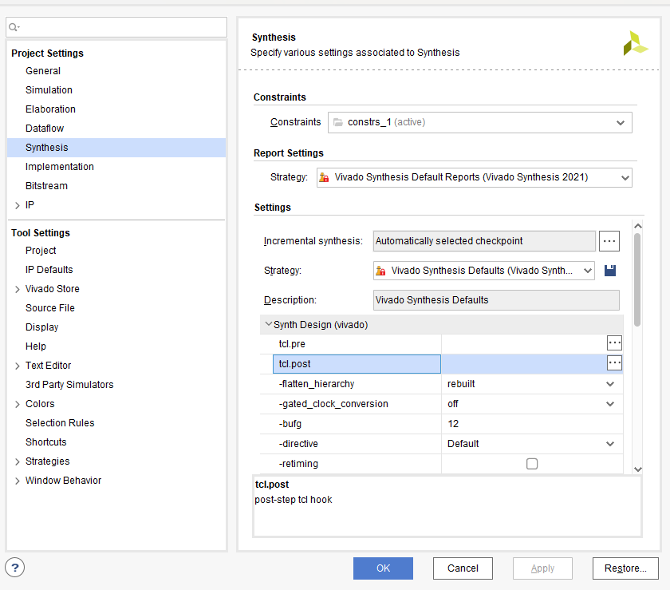

# 生成bit流后发送消息
目前Vivado提供在综合实现完成后触发特定TCL脚本，可以利用此来触发发送消息这一行为。
但是对于综合中间出错的情况，并不能实现自动触发脚本。在实际使用中存在诸多不便。经过多次尝试后，使用tcl脚本直接运行综合编译可以起到报错提示的效果。至于触发后实现发送什么消息怎么发送是一个有较详细的教程的工作。此处仅仅使用app自带功能调用网页地址发送消息。

调用网页地址发送消息的功能详见https://wxpusher.zjiecode.com/docs/#/

## 使用方法
推荐使用inergrated_tcl文件夹中脚本Run_all_V21和Run_all_v22.其分别在vivado 22.2和21.2上成功运行

在下边代码中添加自己对应发送消息的网页链接即可。
```
set url ""
```
